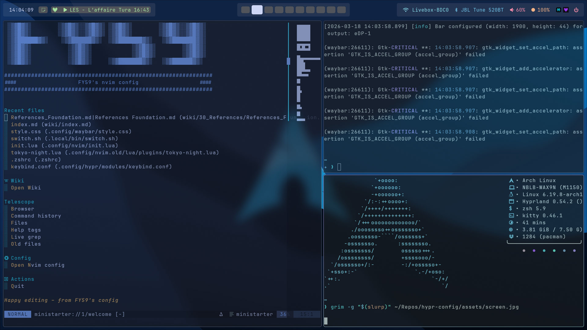

# Hyprland + Waybar config (Arch Linux)

Configuration personnelle Hyprland modulaire avec Hyprlock, Hypridle, Swww, Hyprsunset et double Waybar (top + bottom).

## Screenshot



## Arborescence

```bash
~/.config/hypr
├── hypridle.conf
├── hyprland.conf
├── hyprlock.conf
├── hyprsunset.conf
└── modules
    ├── animation.conf
    ├── autostart.conf
    ├── input.conf
    ├── keybind.conf
    ├── rules.conf
    └── theme.conf
```

## Waybar [dans le repo waybar-config](https://github.com/grayTerminal-sh/waybar-config) :

```bash
~/.config/waybar
├── config
├── style.css
├── config-bottom.jsonc
└── style-bottom.css
```

## Hyprland

hyprland.conf :

```text
monitor= eDP-1,1920x1080@60,0x0,1

env = XDG_CURRENT_DESKTOP,Hyprland
env = XDG_SESSION_TYPE,wayland
env = QT_QPA_PLATFORM,wayland
env = GDK_BACKEND,wayland
env = MOZ_ENABLE_WAYLAND,1

source = ~/.config/hypr/modules/keybind.conf
source = ~/.config/hypr/modules/autostart.conf
source = ~/.config/hypr/modules/input.conf
source = ~/.config/hypr/modules/animation.conf
source = ~/.config/hypr/modules/theme.conf
source = ~/.config/hypr/modules/rules.conf
```

### Modules :

- animation.conf : animations des fenêtres et workspaces.
- autostart.conf : services et applis au démarrage (Waybar, cliphist, kitty scratchpad, etc.).
- input.conf : layout clavier FR, touchpad. 
- keybind.conf : keybinds (SUPER + Return pour kitty, SUPER + B pour Firefox, screenshots grim/slurp, volume, brightness, Waybar scripts…). 
- rules.conf : windowrule pour Deezer, kitty-dropterm, Blueman, Waypaper. 
- theme.conf : gaps, borders, opacité, blur, thème général. 

### Fichiers annexes :
- hypridle.conf : gestion de l’inactivité (lock à 5 min, DPMS off à 10 min). 
- hyprlock.conf : écran de verrouillage custom (horloge, date, batterie, wallpaper). 
- hyprpaper.conf : fond d’écran. 
- hyprsunset.conf : température de couleur (night light). 

## Dépendances
- Hyprland
- Hyprlock
- Hypridle
- Hyprpaper
- Hyprsunset

### Bar / notif / wallpaper
- waybar
- swaync
- swww
- waypaper


### Terminal / apps
- kitty
- firefox
- nautilus
- deezer-desktop
- discord
- google-chrome-stable
- aerc
- yazi
- calcure

### Screenshots / clipboard
- grim
- slurp

### wl-clipboard (wl-copy, wl-paste)
- cliphist
- jq (pour la capture de la fenêtre active)

### Audio / luminosité
- pipewire + wireplumber
- wpctl (pipewire-pulse / wireplumber)
- brightnessctl

### Thèmes / fonts
- Adwaita-dark (GTK)
- Tela-dracula-dark (icônes)
- JetBrains Mono Nerd Font
- AlfaSlabOne (font pour l’horloge de Hyprlock)

## Waybar
Waybar est lancé via modules/autostart.conf : 

```text
exec-once = waybar -c ~/.config/waybar/config -s ~/.config/waybar/style.css
exec-once = waybar -c ~/.config/waybar/config-bottom.jsonc -s ~/.config/waybar/style-bottom.css
Quelques bindings pour contrôler Waybar sont définis dans modules/keybind.conf : 
```

```text
bind = SHIFT CTRL, W, exec, ~/.local/bin/waybar.sh
bind = SUPER, SPACE, exec, ~/.local/bin/waybar-autohide-dock.sh
Les scripts ~/.local/bin/waybar.sh et ~/.local/bin/waybar-autohide-dock.sh ne sont pas inclus ici : il faut les créer à la main ou adapter selon votre setup.
```
## Installation
Cloner le repo :

```bash
git clone https://github.com/<ton-user>/hyprland-config.git ~/Repo/hyprland-config
```

Sauvegarder votre config actuelle (optionnel) :

```bash
mv ~/.config/hypr ~/.config/hypr.bak 2>/dev/null || true
```

Copier ou symlinker :
```bash
mkdir -p ~/.config
ln -s ~/Repo/hyprland-config/.config/hypr ~/.config/hypr
# ou
cp -r ~/Repo/hyprland-config/.config/hypr ~/.config/hypr
(Optionnel) Copier votre config Waybar dans ~/.config/waybar.
```
Recharger Hyprland :
```bash
hyprctl reload
```

## Open/close bottom waybar
- <leader>space
